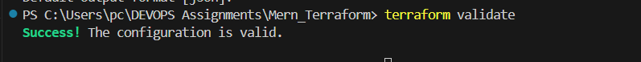

#clearInfrastructure Setup with Terraform

# AWS Setup and Terraform Initialization:

Check you have installed and configured AWS CLI installed with appropriate access credentials for your AWS account.
    
    command: aws configure 

Initialize a Terraform project in the directory.
    
    command: terraform init

# Write a file main.tf

# VPC and Network Configuration:
    
Create AWS VPC and Subnets:
    
We use Terraform to define and deploy an AWS VPC. With this VPC, we create two subnets:
            
 - Public Subnet: This subnet is accessible from the internet, allowing resources placed within it to have public IP addresses and direct internet access.
            
 - Private Subnet: This subnet is isolated from the internet and provides a secure environment for resources that do not require direct internet access.
    
Set Up Internet and NAT Gateways:
        
 - To enable internet access for resources within the VPC, we configure an Internet Gateway (IGW) and attach it to the VPC. This allows resources in the public subnet to communicate with the internet.
        
 - Also, we deploy a Network Address Translation (NAT) Gateway in the public subnet. The NAT Gateway enables resources in the private subnet to access the internet indirectly through the public subnet, while ensuring inbound traffic from the internet is not allowed into the private subnet.

Configure Route Tables:
    
 - Route tables define the rules for routing traffic within the VPC. We create separate route tables for the public and private subnets.

 - In the public route table, we specify a route that directs internet-bound traffic (0.0.0.0/0) to the Internet Gateway (IGW), allowing resources in the public subnet to communicate with the internet directly.

 - In the private route table, we define a route that sends outbound traffic destined for the internet to the NAT Gateway. This enables resources in the private subnet to access the internet through the NAT Gateway in the public subnet.

# EC2 Instance Provisioning:
    
 - Launch two EC2 instances using Terraform: one in the public subnet (for the web server) and another in the private subnet (for the database).

 - Both instances are accessible via SSH. The public instance should only be accessible from the IP address.

# Security Groups and IAM Roles:

Security Groups:
    
 - Opened necessary security groups for web and database servers to control inbound and outbound traffic.

# Resource Output:
    
 - Output the public IP address of the web server EC2 instance to easily access the deployed application.

After settingup the above necessary things.

Run commaand: terraform validate; 

After successfully validate now we terraform have to plan the application.
    
Run command: terraform plan; 
    

After  successfully plan the application, now have to execute the application.
    
Run command: terraform apply; 

Now command is execuited succesfully; now check in the AWS account

Check in VPC service of AWS

Check the other things like (subnets, routes, networking)

